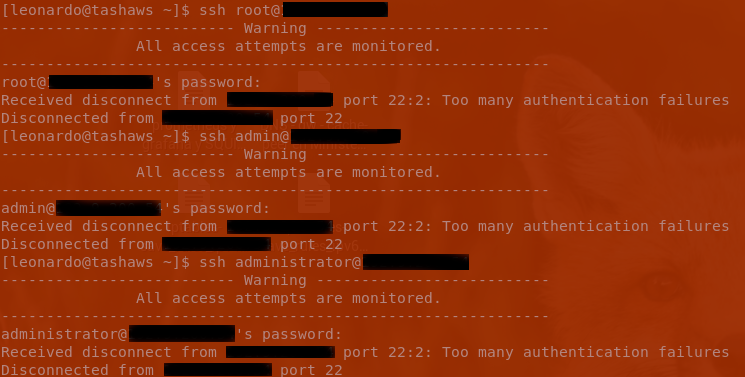

## ssh Hardening
### Description
Restrict access to SSH by changing parameters in the /etc/ssh/sshd_config file.

- *LoginGraceTime 40* a list of errors that have occurred since the command was called is stored in error.log.

<figure>
   <figcaption>Fig.1 Here is an example of a user who does not exist.</figcaption>
   
</figure>

<figure>
  <figcaption>Fig.2 The system detected an attempt to log in as a guest user.</figcaption>
  
</figure>
