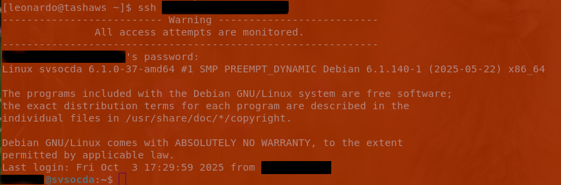

## ssh Hardening
### Description
Restrict access to [SSH](https://www.openssh.com/) by changing parameters in the /etc/ssh/sshd_config file.

- **LoginGraceTime 40** The time after which the server disconnects if the user has not successfully logged in.
- **StrictModes yes** Specifies whether sshd should check file modes and ownership of the user's files and home directory before accepting login.
- **MaxAuthTries 3** specifies the maximum number of authentication attempts permitted per connection. When the login failure count reaches half the number, error messages will be written to the syslog file detailing the login failure.
- **PermitRootLogin no** Disables direct root access.
- **AllowUsers	user1 user2@ip** Disables
- **Banner /etc/banner_ssh** the contents of the file will be printed to the client before login.

<figure>
   <figcaption>Fig.1 Here is an example of a user who does not exist.</figcaption>
   
</figure>

<figure>
  <figcaption>Fig.2 The system detected an attempt to log in as a guest user.</figcaption>
  
</figure>
